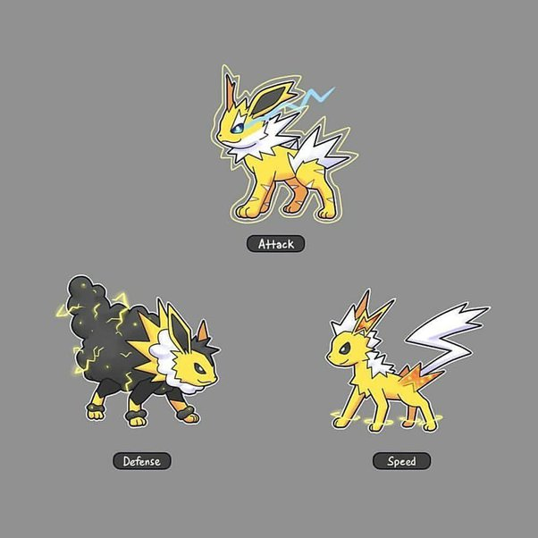
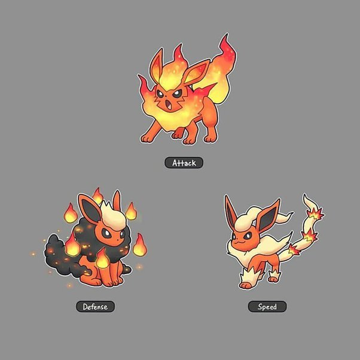
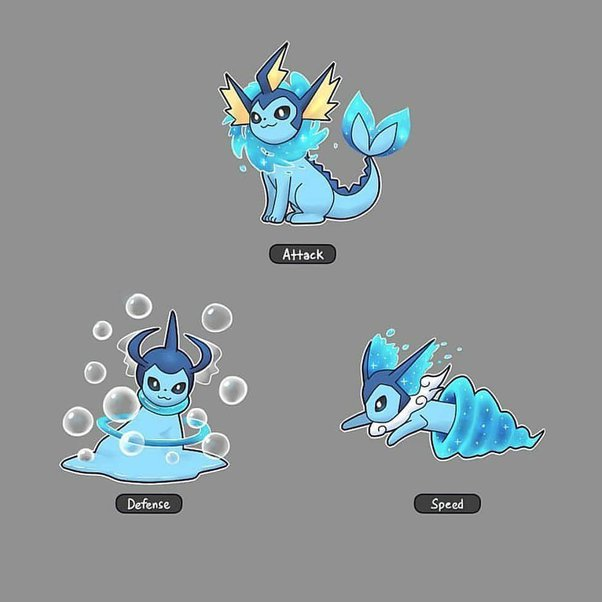
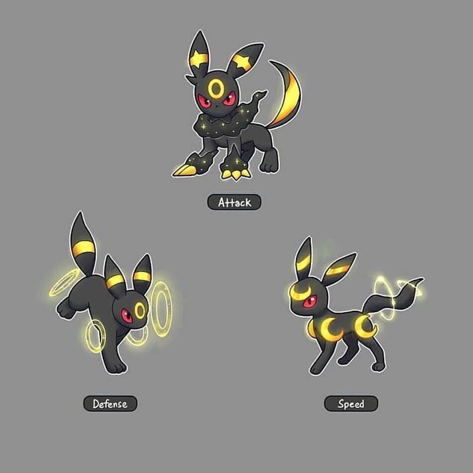
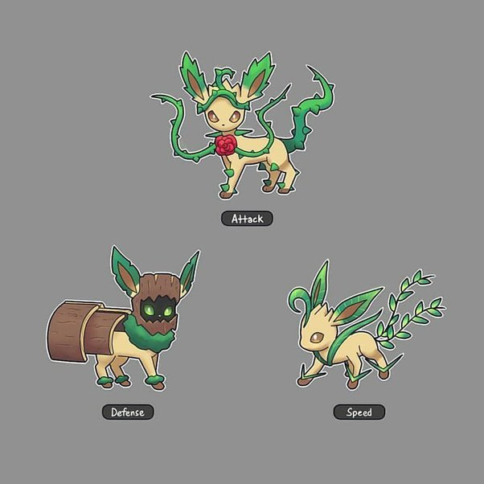
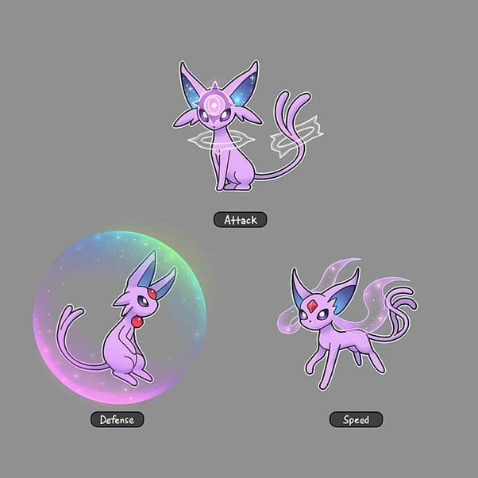
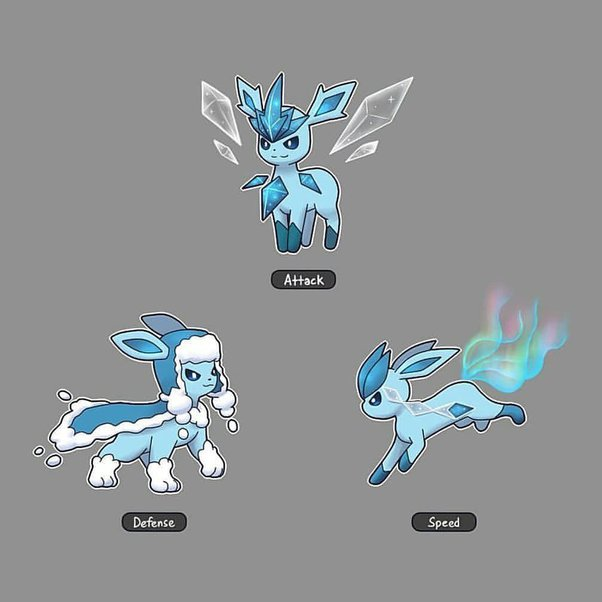
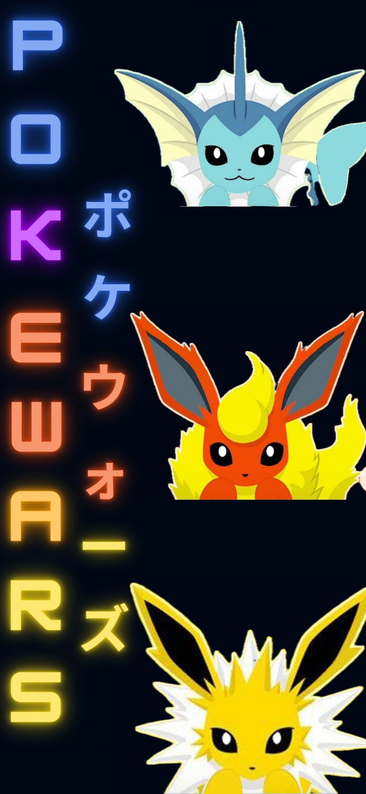

# PokeWars / ポケモンウォーズ

  

# Descritpion
Before human's existing in Pokemon's world, every pokemon existing alone and fight to survive.
The player takes on the role of a previously selected Pokemon.
Player will encounter many dangers and diverse lands in the open world.
Choose Pokemon can switch between 3 mode - attack, speed and defense. 
Every mode have special attributes with increase power attack, speed movemend and defense which will make the gameplay dynamic.

# Inspiration
The game was inspired by the photos below and I will base the game system on them.

  
  
  
  
  
  
  

---

## How to run / Develop ?
+ Unreal Engine 5.3 - For develop game, with blueprints
+ Blender 4.0 - For models
+ Visual Studio / Rider to develop c++ scripts

## Planned features
- [X] Main menu
- [x] Characters menu
- [X] Hp and gaining experience
- [ ] Fighting
- [ ] World with diverse lands 
- [ ] Mobs
- [ ] Tree sklils - 3 panels for attack, defense and speed skills
- [ ] First version - 3 pokemons : Jolteon, Flareon, Vaporeon

## Features in the future
- [ ] Get Pokemon license
- [ ] Lan
- [ ] Bosses (PVE)

## Special's features:
- [ ] Shrek mode - Speed mode (on a donkey)
- [ ] Beaver mode - Defense mode can dam create

---

https://100commitow.pl/

#100commitow

---
## Release
First release soon

  

 
 
 
 
